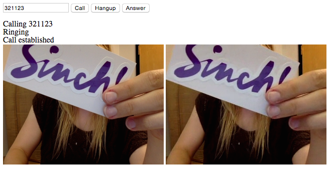

#Building a WebRTC Video Chat Application

The following tutorial will help you set up a bare bones browser-to-browser video calling app. You can find the finished source code for this app on [our GitHub](https://github.com/sinch/js-video-calling) and find out more about our updated [WebRTC SDK](https://www.sinch.com/products/webrtc/).

##Important Notes
- Video calling is currently only supported in Chrome and Firefox.
- Video calling doesn't work on mobile browsers (iOS) because they don't have WebRTC.
- To properly run the app in Chrome, you need to start the browser with the flag `--allow-file-access-from-files`. This is to allow local files to run properly in your web browser. ([Learn more here](https://www.sinch.com/tutorials/how-to-start-chrome-with-flags/).)
- This tutorial uses Sinch user management. This is only for development purposes. When you're ready for production you will need to authenticate users and secure your app which you are able to do with our [Rails + Devise tutorial](https://www.sinch.com/tutorials/authenticating-sinch-rails-devise/) and [C# tutorial](https://www.sinch.com/tutorials/using-delegated-security-application-server-using-c-sinch-sdk/).

##Setup
1. Sign up for a Sinch developer account at [sinch.com/signup](https://www.sinch.com/signup). Follow the steps and you will be on your way to video chatting!
2. In the developer dashboard, create a new app. Once you have created a new app, go ahead and take note of the [app key](https://www.sinch.com/dashboard/#/apps) and app secret, these are unique for your application so be sure you keep them away from prying eyes.
3. Go ahead and download the latest Sinch JavaScript SDK from [sinch.com/downloads](https://www.sinch.com/downloads).
4. Make an easily-accessible folder on your computer to store the files for this project.
5. Go ahead and create the files **index.html** and **index.js**. If you are looking for a good code-editor, Sublime Text is a good (and free) starting point.
6. From the Sinch JavaScript SDK that you downloaded earlier, move **sinch.min.js** into your project's main directory so that it's accessible to your **index.html** and **index.js** files.

##View
We've made the HTML for this sample as simple as possible to easily showcase the video functionality. After you have video calling implemented, feel free to go ahead and polish the interface. Bootstrap is an easy way to get a responsive web page without the hassle. As you will see, we've added some in-line comments below to explain functionality.

    <head>
        
        
        
    </head>
    
    <body>
        <!-- This form is the only thing that is displayed by default -->
        <form id="authForm">
            <input type="text" id="username" placeholder="username">
            <input type="password" id="password" placeholder="password">
            <input type="submit" value="Login" id="login">
            <input type="submit" value="Sign Up" id="signup">
        </form>
    
        <!-- Hidden until the Sinch client is started successfully -->
        

            <form id="callForm">
                <input type="text" id="usernameToCall" placeholder="username to call">
                <input type="submit" value="Call" id="call">
                <input type="submit" value="Hangup" id="hangup">
                <input type="submit" value="Answer" id="answer">
            </form>
    
            <!-- Will show updates on the current call -->
            

    
            <!-- Will show video streams once call is connected -->
            <video id="outgoing" autoplay></video>
            <video id="incoming" autoplay></video>
        

    </body>
    
##Define the Sinch client
    
First, be sure to enclose all of your JavaScript in this method:

    $("document").ready(function() {
        //all js code here!
    });

`.ready()` is a JQuery function which is called when the web page is initialized, therefore, this is where we are going to initialize the Sinch client.

Go ahead and define the Sinch client with your application key and enable calling and video capabilities. The secret key isn't used in Javascript as the code can be viewed/manipulated by any user.

    sinchClient = new SinchClient({
        applicationKey: "YOUR_APP_KEY",
        capabilities: {calling: true, video: true},
        supportActiveConnection: true,
        onLogMessage: function(message) {
            console.log(message.message);
        },
    });
    
Then, create variables to store the Sinch call client and the current call (if there is one).
    
    var callClient;
    var call;  
    
##Signup and Login

You can start the Sinch client (for testing purposes only) with a username and password. In a production environment you will need a secure and robust authentication system.

    $("#login").on("click", function (event) {
        event.preventDefault();
        
        var signUpObj = {};
        signUpObj.username = $("input#username").val();
        signUpObj.password = $("input#password").val();

        sinchClient.start(signUpObj, afterStartSinchClient());          
    });
    
To create the user within your app, register the new user with Sinch, and then start the client with the returned ticket.

    $("#signup").on("click", function (event) {
        event.preventDefault();
        
        var signUpObj = {};
        signUpObj.username = $("input#username").val();
        signUpObj.password = $("input#password").val();

        sinchClient.newUser(signUpObj, function(ticket) {
            sinchClient.start(ticket, afterStartSinchClient());
        });
    });
    
In the above we are simply getting the username and password objects from the form and playing them in the `signUpObg` which we then use to generate the ticket and initialize the SinchClient with the new user.
    
Now, define the method `afterStartSinchClient()`, which is called after the client has been started. At this point we now know that the new user has been created so we can go ahead and change the web page's appearance. In addition to this we want to make sure we are able to accept incoming calls and the browser is ready to handle audio/video.

    function afterStartSinchClient() {
        // hide auth form
        $("form#authForm").css("display", "none");
        // show logged-in view
        $("div#sinch").css("display", "inline");
        // start listening for incoming calls
        sinchClient.startActiveConnection();
        // define call client (to handle incoming/outgoing calls)
        callClient = sinchClient.getCallClient();
        //initialize media streams, asks for microphone & video permission
        callClient.initStream();
        //what to do when there is an incoming call
        callClient.addEventListener(incomingCallListener);
    }
    
##Incoming call and current call listeners

To listen for incoming calls go ahead and add the below variable:

    var incomingCallListener = {
        onIncomingCall: function(incomingCall) {
        	//Change the view to display an incoming call
            $("div#status").append("
Incoming Call
");
            //assign the call variable to the incoming call
            call = incomingCall;
            //Use the addEventListener method on the call object to make sure we are updated of any changes to the call's status
            call.addEventListener(callListeners);
        }
    }

    
Add the callListeners variable and the following to make changes based on the call's status:
    
    var callListeners = {
        //call is "ringing"
        onCallProgressing: function(call) {
            $("div#status").append("
Ringing
");
        },
        //they picked up the call!
        onCallEstablished: function(call) {
            $("div#status").append("
Call established
");
            $("video#outgoing").attr("src", call.outgoingStreamURL);
            $("video#incoming").attr("src", call.incomingStreamURL);
        },
        //ended by either party
        onCallEnded: function(call) {
            $("div#status").append("
Call ended
");
            $("video#outgoing").attr("src", "");
            $("video#incoming").attr("src", "");
            call = null;
        }
    }  
    
##Call, answer and hang up

The final piece is letting users start and stop calls.

    //When the call button is clicked, gether the username to call
    $("#call").on("click", function (event) {
        event.preventDefault();
        //if there isn't a current call
        if (!call) {
            usernameToCall = $("input#usernameToCall").val()
            //change the value of the status label
            $("div#status").append("
Calling " + usernameToCall + "
");
            //change the call variable to the new call
            call = callClient.callUser(usernameToCall);
            //monitor the status of the call through callListeners
            call.addEventListener(callListeners);
    	    }   
    });

	//Ansering a cal
    $("#answer").click(function(event) {
        event.preventDefault();
        //make sure a call exists before attempting to answer
        if (call) {
            $("div#status").append("
You answered the call
");
        	   call.answer();
        }
    });
    
	//Hangup
    $("#hangup").click(function(event) {
        event.preventDefault();
        //Make sure there is a current call to hangup
        if (call) {
            $("div#status").append("
You hung up the call
");
            //Simply call the hangup() method on the call variable
            call.hangup();
            //set the call variable to null and then you are ready to call again!
            call = null
        }
    });
    
And you're done! To test your app, open the **index.html** file in two separate browser tabs, sign up as two different users (two seperate usernames), and try calling each other. Please keep in mind that this is just a demo app to showcase the awesome video-calling functionality. Before releasing this in a production environment make sure to implement error handling and of course a fancy interface, in addition to ensuring security. If you're trying to run this code in Chrome, don't forget to start your browser with the `--allow-file-access-from-files` flag. 

If you have questions feel free to leave them in the comments below or contact the awesome support team at Sinch, we are always here to help! Don't forget, we've got video calling built-in to the iOS and Android SDK now.
